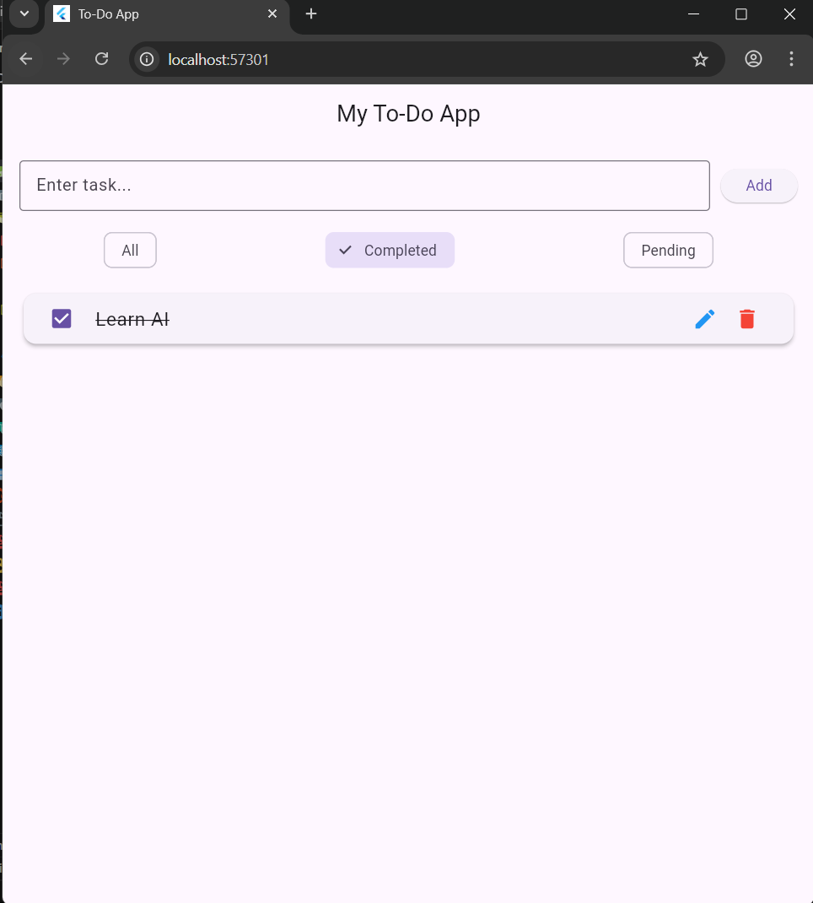
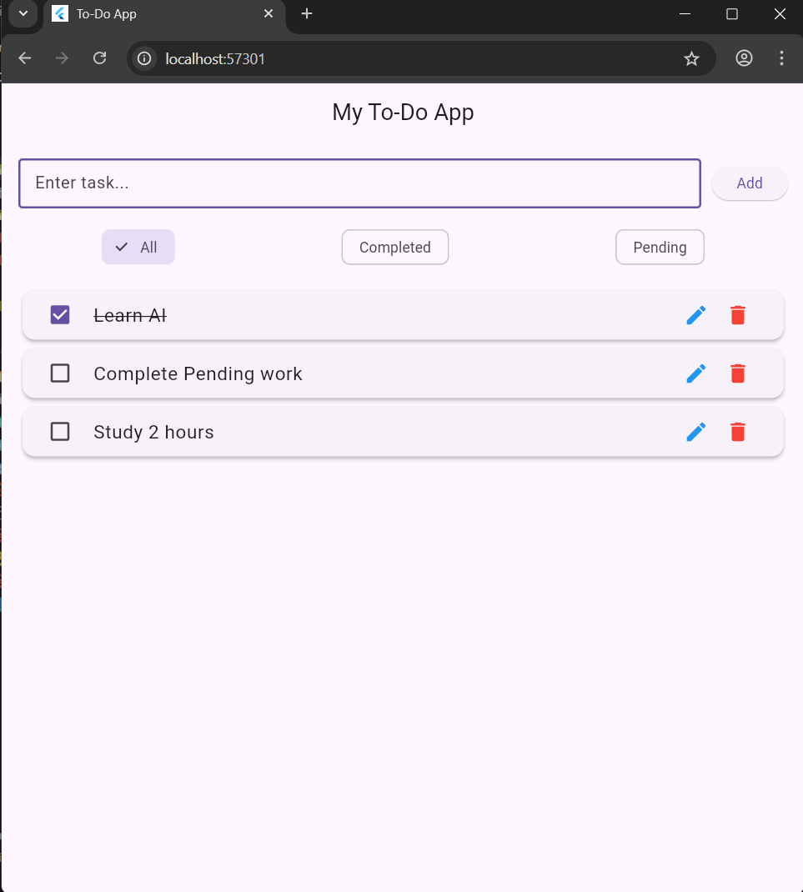
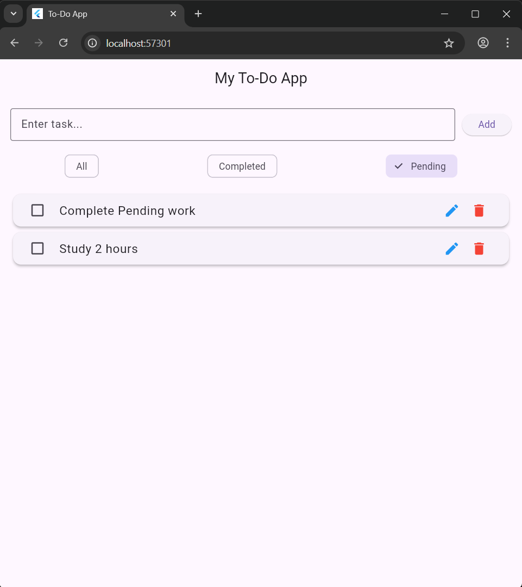

<!-- Great, Aastha!
Here is a **professional GitHub-level README**, including:

✅ Project Banner
✅ Badges
✅ App Preview Sections
✅ Features Table
✅ Tech Stack
✅ Screenshots placeholders
✅ Installation & Build Guide
✅ Contribution Guide
✅ License section
✅ Clean formatting like real GitHub projects

You can directly paste this into your GitHub **README.md** file. -->

---

# 🌟 **BASIC_APP To-Do App (Flutter)**

<h1 align="center">📝 Flutter To-Do App</h1>

<p align="center">A clean, modern task manager built using Flutter + Local Storage</p>

<p align="center">
  
  
  
  
  
</p>

---

# 📱 **App Preview**


<p align="center">
  
  
  
</p>

---

# 🚀 **Overview**

A simple and beautiful **To-Do List App** built in Flutter.
Supports adding tasks, editing, deleting, marking completed, filtering, and saving data locally using **SharedPreferences**.

Perfect for beginners learning:

* Flutter UI
* Widgets
* State management
* Local storage
* Clean architecture

---

# ✨ **Features**

| Feature          | Description                                 |
| ---------------- | ------------------------------------------- |
| ➕ Add Tasks      | Enter and save tasks instantly              |
| ✔ Mark Complete  | Checkbox to toggle between pending/complete |
| 📝 Edit Tasks    | In-app editing using dialog                 |
| 🗑 Delete Tasks  | Remove tasks with swipe or button           |
| 🔍 Filter Tasks  | View All, Completed, or Pending             |
| 💾 Local Storage | Saves tasks even after closing app          |
| 🎨 Modern UI     | Card layout, shadows, rounded corners       |
| 🌙 Dark Mode     | System theme support                        |

---

# 🧩 **Tech Stack**

* **Flutter 3.x**
* **Dart**
* **SharedPreferences** (local storage)
* **Material UI**
* **setState()** for state management

---

# 🗂 **Project Structure**

```
lib/
 ├─ main.dart                    # App entry point
 ├─ screens/
 │   └─ home_screen.dart         # Main UI + Logic
 ├─ widgets/
 │   └─ task_tile.dart           # Reusable task UI component
 └─ models/
     └─ task.dart                # Task Model class
```

---

# 🧠 **How It Works**

### ✔ Add Task

* User types text
* Tapping "Add" stores task in `List<Task>`
* Task saved using `SharedPreferences`

### ✔ Edit Task

* Show `AlertDialog`
* User updates text
* Task resaved

### ✔ Mark Complete

* Checkbox toggles `isDone`
* UI updates using `setState()`

### ✔ Delete

* `removeAt(index)` removes task
* Swipe to delete also supported

### ✔ Filter

* FilterChip updates state
* ListView shows filtered tasks

### ✔ Local Storage

Tasks stored as:

```json
{"title": "Buy groceries", "isDone": false}
```

---

# 🛠 **Installation**

### Clone the repository:

```bash
git clone https://github.com/yourusername/todo_app.git
cd todo_app
```

### Install dependencies:

```bash
flutter pub get
```

### Run the app:

```bash
flutter run
```

---

# ⚙ **Dependencies**

```yaml
shared_preferences: ^2.2.2
cupertino_icons: ^1.0.2
```

---

# 📌 **Screenshots (Folder Structure)**

Put your images in:

```
/screenshots
    home.png
    add_task.png
    edit_task.png
```

---

# 🤝 **Contributing**

Contributions are welcome!

1. Fork the repo
2. Create your feature branch
3. Commit changes
4. Open a pull request

---

# 📄 **License**

This project is licensed under the **MIT License**.
You are free to use, modify, and distribute it.

---

# ❤️ **Acknowledgements**

* Flutter Dev Team
* Dart Language
* Open Source Community

---

# 🔮 **Future Enhancements**

* 📅 Task due dates
* ⏰ Notification reminders
* 🗂 Categories & tags
* 🌩 Cloud Sync with Firebase
* 🧭 Navigation Drawer
* 👤 User accounts

---

If you want, I can also:

✅ Generate a **GitHub banner image**
✅ Create **screenshots layout**
✅ Create **badges**
✅ Write a **LICENSE.txt** file

Just say:
**“Make banner”** or **“Generate license file”** or **“Add screenshot section”**
